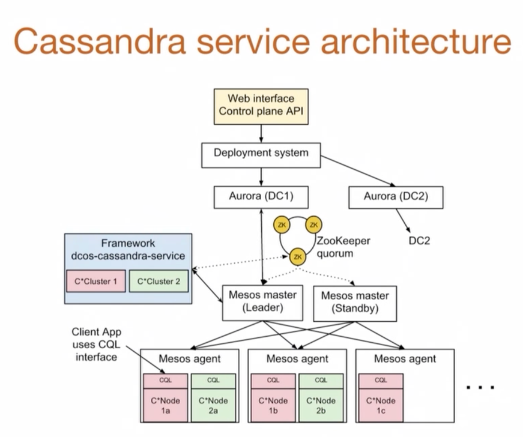

# How Uber manages a Million Writes Per Second Using Mesos and Cassandra Across Multiple Datacenters?

# Co-Host services
- A single machine can run services of different kinds. (Co-host services on the single machine)
- Statistically multiplexing services on the same machine can lead to needing 30% fewer machines. This is a finding from an experiment run at Google on Borg.
- If, for example, one services uses a lot of CPU it matches well with a service that uses a lot of storage or memory, then these two services can be efficiently run on the same server. Machine utilization goes up.

# Stats

| Stat                  | Remarks                                                                                                                                                                                         |
|-----------------------|-------------------------------------------------------------------------------------------------------------------------------------------------------------------------------------------------|
| 20 Cassandra clusters | As in 2016, Uber had about [20 Cassandra clusters](https://github.com/Anshul619/HLD-System-Designs/tree/main/1_Databases/11_WideColumn-Databases/ApacheCasandra.md) and planned on having 100 in the future. |
| Nodes                 | ~300 machine across two data centers.                                                                                                                                                           |
| Largest 2 clusters    | One of the clusters was storing the location that was sent out every 30 seconds by both the driver and rider apps.                                                                              |
| Throughput            | More than a million writes/sec and ~100k reads/sec`                                                                                                                                             |

# App Provisioning
- Uber use [Docker containers](https://github.com/Anshul619/DevOps-SRE/tree/main/2_ContainerOrchestration/Docker/Readme.md) on [Mesos](https://github.com/Anshul619/DevOps-SRE/tree/main/2_ContainerOrchestration/ApacheMarathon&Mesos.md) to run their microservices with consistent configurations scalable, with help from Aurora for long-running services and cron jobs.
- One of Uber infrastructure teams, Application Platform, produced a template library that builds services into shippable [Docker images](https://github.com/Anshul619/DevOps-SRE/tree/main/2_ContainerOrchestration/Docker/Readme.md).

# References
- [HighScalability - How Uber Manages a Million Writes Per Second Using Mesos and Cassandra Across Multiple Datacenters?](http://highscalability.com/blog/2016/9/28/how-uber-manages-a-million-writes-per-second-using-mesos-and.html)
- [Cassandra on Mesos Across Multiple Datacenters at Uber (Abhishek Verma) | C* Summit 2016](https://www.youtube.com/watch?v=4Ap-1VT2ChU)